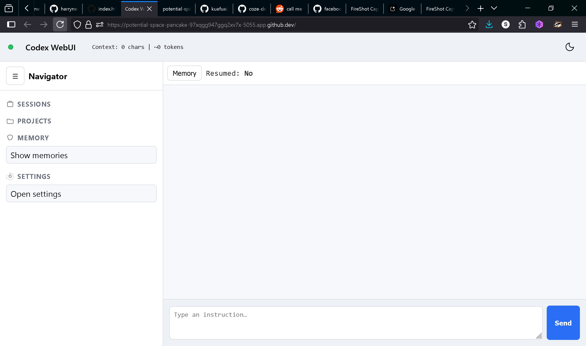
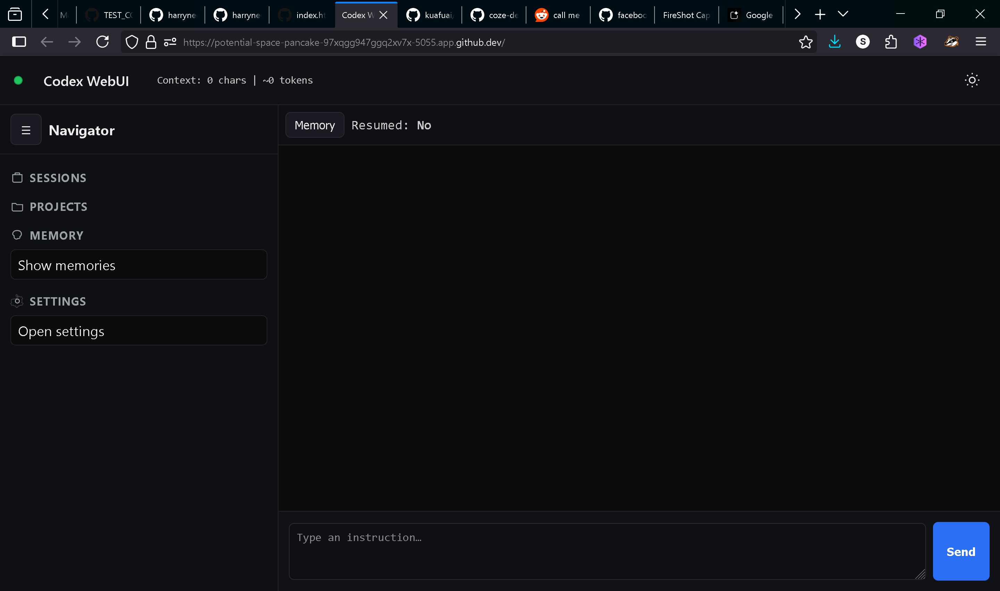
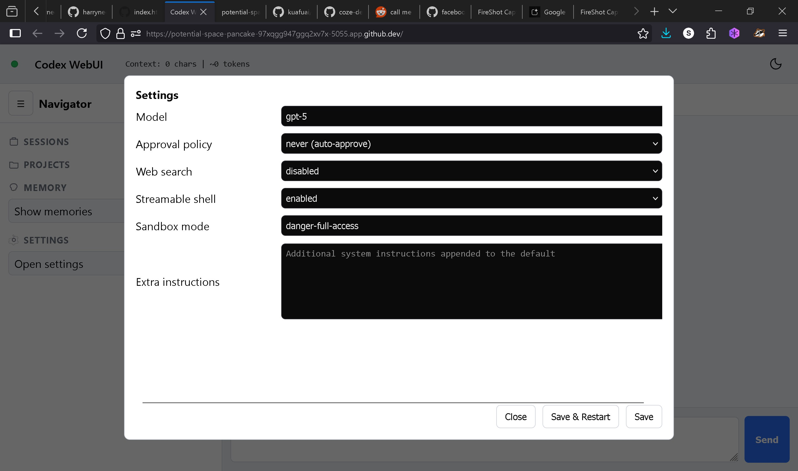
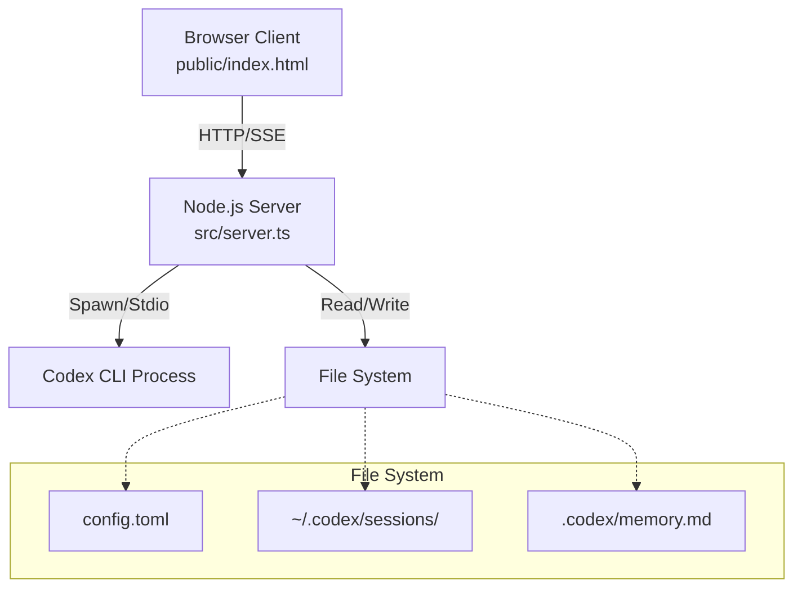

# Codex WebUI


> **Note**: This is the **TypeScript** version of Codex WebUI. For the original single-file JavaScript version, see the [`master`](https://github.com/harryneopotter/Codex-webui/tree/master) branch.

A tiny, **zero runtime dependency** Web UI that wraps the local **OpenAI Codex CLI**. It streams output via **SSE**, resumes from your latest sessions, and lets you manage persistent memory — all from a clean, dark-mode browser interface.

> **Note**: This project is not affiliated with OpenAI. It runs entirely on your local machine.


 

  

## ✨ Features

*   **🔌 Local & Private**: Spawns your local `codex` binary. No data leaves your machine unless you configure it to.
*   **📡 Real-time Streaming**: Uses Server-Sent Events (SSE) for instant feedback.
*   **🧠 Persistent Memory**: View and manage long-term memory facts stored in `.codex/memory.md`.
*   **♻️ Smart Resume**: Automatically resumes from your last "rollout" or lets you pick from history.
*   **🛡️ Zero Runtime Dependencies**: The production build uses only native Node.js modules.
*   **🐳 Docker Ready**: Includes a Dockerfile for easy containerization.

## Why I Built This

The original OpenAI Codex CLI is incredibly powerful, but its terminal interface can get cluttered with scrolling output, lost context, and no built-in persistence. I built this WebUI to provide:

- **Clean Interface**: A distraction-free browser UI with real-time streaming.
- **Session Management**: Easy resume from previous conversations.
- **Memory Persistence**: Long-term fact storage across sessions.
- **Zero Dependencies**: Runs on native Node.js, no heavy frameworks.

It's designed for developers who want the power of Codex without the terminal hassle.

## CLI vs WebUI Comparison

| Feature              | CLI                          | WebUI                        |
|----------------------|------------------------------|------------------------------|
| Real-time Streaming  | ❌ (Scrolls away)           | ✅ (Live updates)            |
| Session Resume       | ❌ (Lost on exit)           | ✅ (Persistent sessions)     |
| Memory Persistence   | ❌ (No built-in)            | ✅ (`.codex/memory.md`)      |
| UI/UX                | Terminal (messy)            | Browser (clean)              |
| Dependencies         | None                        | Zero Runtime                 |
| Setup                | `codex` command             | `npm run build && npm start` |

## 🚀 Quick Start

### Option 1: Using Node.js (Recommended)

1.  **Clone & Install**:
    ```bash
    git clone https://github.com/harryneopotter/Codex-webui.git
    cd Codex-webui
    npm install
    ```

2.  **Build & Run**:
    ```bash
    npm run build
    npm start
    ```

3.  **Open**: The server runs on `http://0.0.0.0:5055`. In GitHub Codespaces or dev containers, forward port 5055 and visit the forwarded URL (e.g., `https://your-codespace-name-5055.app.github.dev`).

### Option 2: Using Docker

```bash
docker build -t codex-webui .
docker run -p 5055:5055 -v ~/.codex:/root/.codex codex-webui
```

## ⚙️ Configuration

You can configure the server via environment variables or the `config.toml` file.

### Environment Variables (`.env`)

| Variable | Default | Description |
|----------|---------|-------------|
| `PORT` | `5055` | Port to listen on |
| `HOST` | `0.0.0.0` | Interface to bind to |
| `WEBUI_TOKEN` | *None* | Optional Bearer token for auth |
| `CODEX_CMD` | `codex` | Path to your Codex binary |

### Runtime Config (`config.toml`)

Edit `config.toml` or use the **Settings** gear icon in the UI to change:
*   **Model**: `gpt-5` (or other supported models)
*   **Approval Policy**: `never` (auto-approve) or `ask`
*   **Sandbox Mode**: `danger-full-access`

## 🏗️ Architecture

The project follows a modular TypeScript architecture.

> **Legacy Comparison**: Unlike the `master` branch which uses a single `server.js` file, this version splits logic into services and utilities for better maintainability.



For a deep dive, check out:
*   [**Design Document**](docs/DESIGN.md): Philosophy and technical decisions.
*   [**Architecture Document**](docs/ARCHITECTURE.md): Component breakdown and data flow.
*   [**Tool Review**](docs/tool-review.md): Critical assessment, feature inventory, and ratings.

## 🛠️ Development

This project is built with **TypeScript** and enforces code quality via **ESLint** and **Prettier**.

### Commands

*   **Build**: `npm run build` - Compiles TypeScript to `dist/`.
*   **Dev**: `npm run dev` - Runs with `tsc --watch`.
*   **Test**: `npm test` - Runs the test suite (using Node.js native test runner).
*   **Lint**: `npm run lint` - Checks for code quality issues.
*   **Format**: `npm run format` - Auto-formats code with Prettier.

## 🤝 Contributing

We welcome contributions! Please see [CONTRIBUTING.md](CONTRIBUTING.md) for guidelines on how to set up your development environment.

## 📄 License

MIT © [HarryNeoPotter](https://github.com/harryneopotter)
