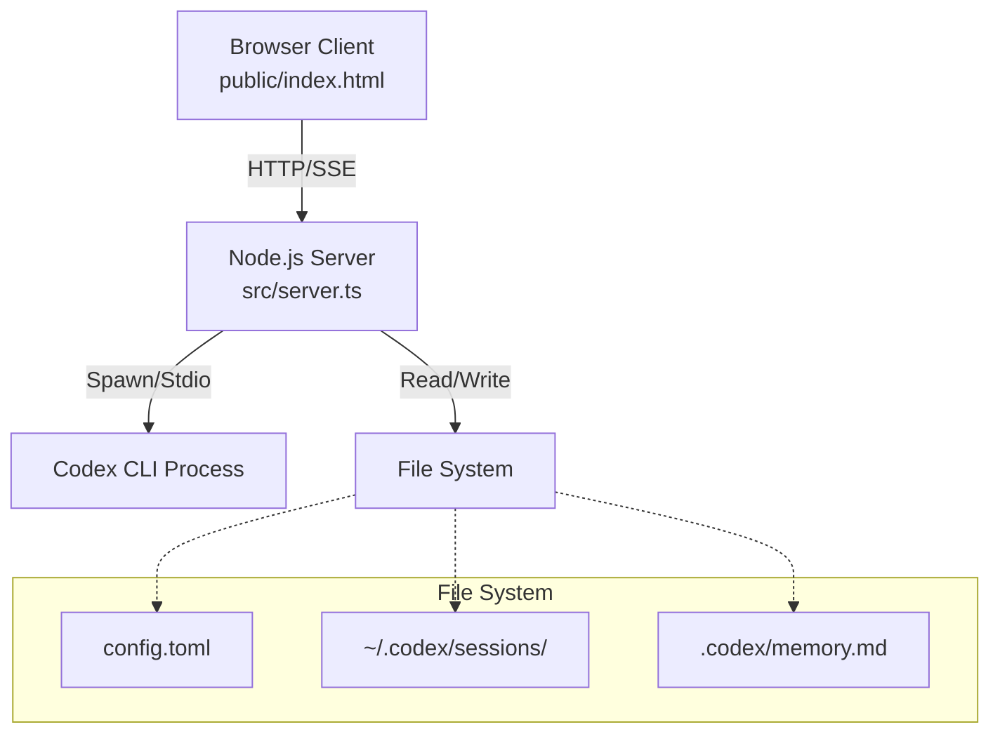

# Codex WebUI


A tiny, **dependency-free** Web UI that wraps the local **OpenAI Codex CLI**. It streams output via **SSE**, resumes from your latest sessions, and lets you manage persistent memory — all from a clean, dark-mode browser interface.

> **Note**: This project is not affiliated with OpenAI. It runs entirely on your local machine.


## ✨ Features

*   **🔌 Local & Private**: Spawns your local `codex` binary. No data leaves your machine unless you configure it to.
*   **📡 Real-time Streaming**: Uses Server-Sent Events (SSE) for instant feedback.
*   **🧠 Persistent Memory**: View and manage long-term memory facts stored in `.codex/memory.md`.
*   **♻️ Smart Resume**: Automatically resumes from your last "rollout" or lets you pick from history.
*   **🛡️ Zero Dependencies**: The runtime uses only native Node.js modules.
*   **🐳 Docker Ready**: Includes a Dockerfile for easy containerization.

## 🚀 Quick Start

### Option 1: Using Node.js (Recommended)

1.  **Clone & Install**:
    ```bash
    git clone https://github.com/harryneopotter/Codex-webui.git
    cd Codex-webui
    npm install
    ```

2.  **Build & Run**:
    ```bash
    npm run build
    npm start
    ```

3.  **Open**: Visit `http://127.0.0.1:5055` in your browser.

### Option 2: Using Docker

```bash
docker build -t codex-webui .
docker run -p 5055:5055 -v ~/.codex:/root/.codex codex-webui
```

## ⚙️ Configuration

You can configure the server via environment variables or the `config.toml` file.

### Environment Variables (`.env`)

| Variable | Default | Description |
|----------|---------|-------------|
| `PORT` | `5055` | Port to listen on |
| `HOST` | `127.0.0.1` | Interface to bind to |
| `WEBUI_TOKEN` | *None* | Optional Bearer token for auth |
| `CODEX_CMD` | `codex` | Path to your Codex binary |

### Runtime Config (`config.toml`)

Edit `config.toml` or use the **Settings** gear icon in the UI to change:
*   **Model**: `gpt-5` (or other supported models)
*   **Approval Policy**: `never` (auto-approve) or `ask`
*   **Sandbox Mode**: `danger-full-access`

## 🏗️ Architecture

The project follows a modular TypeScript architecture.



For a deep dive, check out:
*   [**Design Document**](docs/DESIGN.md): Philosophy and technical decisions.
*   [**Architecture Document**](docs/ARCHITECTURE.md): Component breakdown and data flow.

## 🤝 Contributing

We welcome contributions! Please see [CONTRIBUTING.md](CONTRIBUTING.md) for guidelines on how to set up your development environment.

## 📄 License

MIT © [HarryNeoPotter](https://github.com/harryneopotter)
