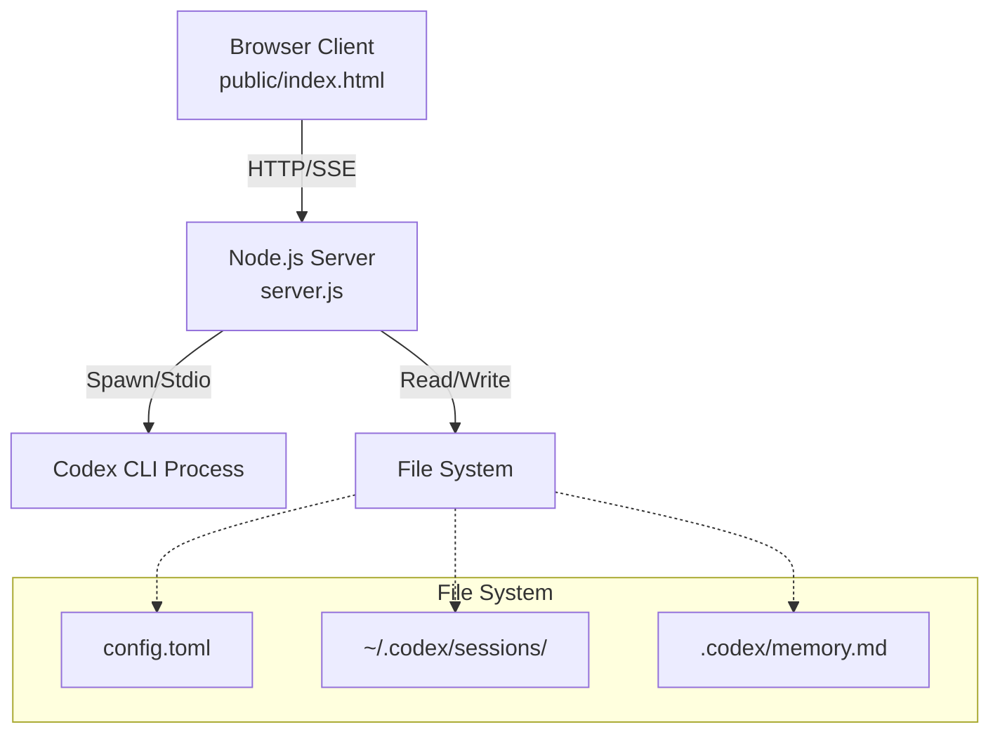
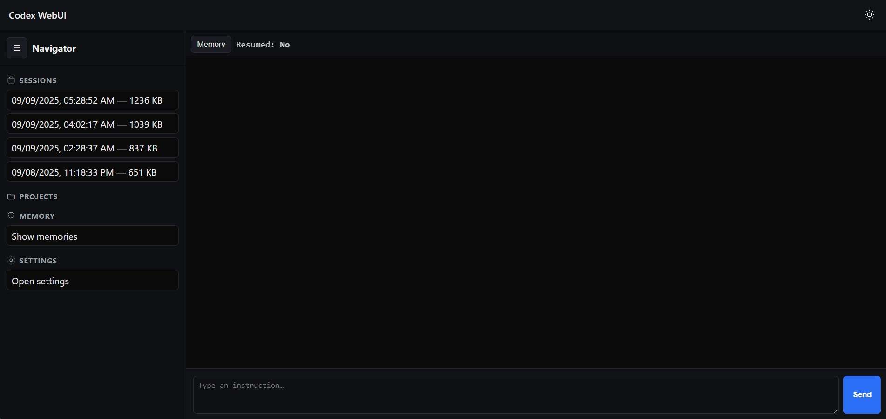
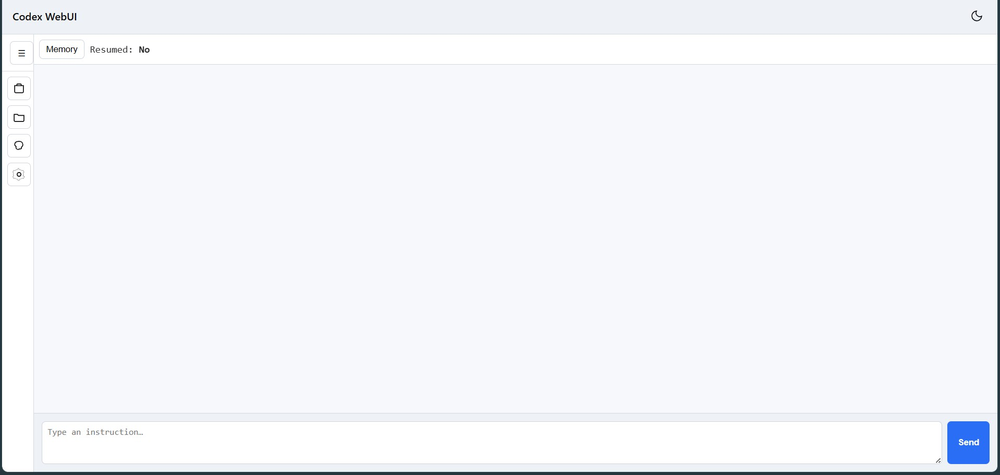

# Codex WebUI

A tiny, dependency‑free Web UI that wraps the local **OpenAI Codex CLI**. It streams output via **SSE**, resumes from your latest `rollout-*.jsonl`, and lets you manage sessions & memory — all from a single static page.

> Not affiliated with OpenAI. Runs entirely on your machine.

## Why
The Codex terminal can get messy (scrollback/overwrites). This provides a clean browser UI with streaming, resume, and small quality‑of‑life tools.

## Architecture



### Core Components

**Server (`server.js`):**
- HTTP server with SSE streaming for real-time communication
- Spawns and manages Codex CLI child processes
- Handles session resume from `~/.codex/sessions/*.jsonl` files
- Manages persistent memory in `.codex/memory.md`

**Client (`public/index.html`):**
- Single-page application with vanilla JavaScript
- Real-time message streaming via EventSource

## Screenshots

### Dark Theme


### Light Theme


## Features
- 🔌 **Local only**: spawns your `codex` binary
- 📡 **SSE streaming** with connection status
- ♻️ **Resume** from latest rollout or pick any session file
- 🧠 **Memory** viewer & delete (writes to `.codex/memory.md`)
- ⚙️ Config UI for model / approval / sandbox / extras
- 🛡️ Optional bearer token for mutating routes

## Installation

### Prerequisites
- Node.js 18+ installed on your system
- OpenAI Codex CLI installed and configured

### Setup

1. **Clone the repository:**
   ```bash
   git clone https://github.com/harryneopotter/Codex-webui.git
   cd Codex-webui
   ```

2. **Install dependencies (optional - this project is dependency-free):**
   ```bash
   npm install  # Only needed for development scripts
   ```

3. **Configure environment (optional):**
   ```bash
   cp .env.example .env
   # Edit .env with your preferences
   ```

## Quick Start

### Method 1: Using npm scripts
```bash
npm start
# or for development with auto-reload:
npm run dev
```

### Method 2: Direct node execution
```bash
# 1) Run the server (default binds to loopback)
HOST=127.0.0.1 PORT=5055 node server.js

# 2) Open the UI
open http://127.0.0.1:5055   # macOS
# Windows:
start http://127.0.0.1:5055
# Linux:
xdg-open http://127.0.0.1:5055
```

> Tip: If you ever expose it behind a proxy, set `ALLOW_ORIGIN` and `WEBUI_TOKEN`, or tunnel with SSH/Tailscale.

## Environment
See `.env.example` for all supported variables.

## Endpoints (brief)
- `GET /` — static UI
- `GET /events` — SSE stream (status, deltas, tool, stderr)
- `POST /message` — send user text (`{ text }`)
- `GET /sessions` — list session files
- `POST /resume` — `{ path }` to a rollout file
- `GET /session-messages` — last 100 messages from current session
- `GET /projects` — history grouped by `workdir`
- `GET /memory` / `DELETE /memory` — view/remove facts
- `GET /config` / `PUT /config` — read/update config (whitelisted keys)
- `POST /restart` — restart Codex with current resume
- `POST /shutdown` — ask Codex to shut down

## Security
- Default bind: `127.0.0.1`
- Default CORS: `http://localhost:PORT`
- Optional bearer token: set `WEBUI_TOKEN` if exposing

## License
MIT — see `LICENSE`.
