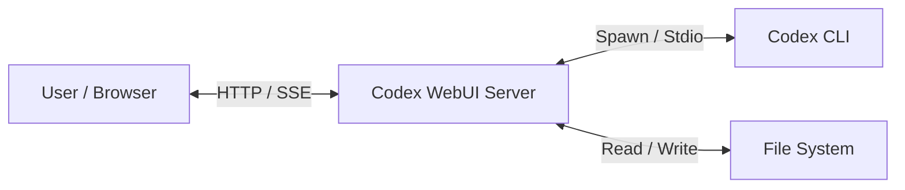

# Codex WebUI Architecture

## System Context

Codex WebUI acts as a bridge between a web browser and the command-line Codex agent.



## Component Architecture

The backend is structured into three layers: **Routes**, **Services**, and **Utilities**.

### 1. Server Layer (`src/server.ts`)
*   **Entry Point**: Initializes the HTTP server.
*   **Routing**: Manages HTTP endpoints (`GET /events`, `POST /message`, etc.).
*   **Middleware**: Applies CORS, Authentication, and Rate Limiting.
*   **SSE Management**: Maintains a list of active clients and broadcasts events.

### 2. Service Layer (`src/services/`)
Encapsulates the core business logic.

*   **`CodexService` (`codex.ts`)**:
    *   **Process Management**: Spawns the `codex` binary with `spawn()`.
    *   **Event Parsing**: Reads `stdout` stream, parses JSON lines, and emits typed events (`agent_message`, `tool_use`, etc.).
    *   **State**: Tracks the current session status and resume path.
*   **`MemoryService` (`memory.ts`)**:
    *   **Persistence**: Reads/Writes to `.codex/memory.md`.
    *   **Fact Extraction**: Parses `SAVE_MEMORY:` directives from agent output.

### 3. Utility Layer (`src/utils/`)
Helper functions that support the services.

*   **`Config` (`config.ts`)**: Custom TOML parser/serializer for `config.toml`.
*   **`FileSystem` (`fs-helpers.ts`)**: Scans directories for session files and parses history logs.
*   **`RateLimit` (`rate-limit.ts`)**: In-memory sliding window rate limiter.

## Data Flow

### 1. User Sends a Message
1.  **Client**: POSTs JSON `{ text: "..." }` to `/message`.
2.  **Server**: Validates Auth & Rate Limit.
3.  **CodexService**:
    *   Reads current memory facts.
    *   Formats message with `<memory>` context.
    *   Writes JSON payload to Codex process `stdin`.

### 2. Agent Responds
1.  **Codex Process**: Writes JSON line to `stdout`.
2.  **CodexService**:
    *   Parses JSON.
    *   If `agent_message`: buffers text, checks for `SAVE_MEMORY:`.
    *   Emits internal event.
3.  **Server**:
    *   Catches event.
    *   Broadcasts via SSE to all connected clients.
4.  **Client**: Updates DOM with new text.

## Directory Structure

```
/
├── dist/               # Compiled JavaScript (Production)
├── src/                # TypeScript Source
│   ├── server.ts       # Main entry point
│   ├── services/       # Business logic
│   ├── utils/          # Helpers
│   └── types.ts        # Interfaces
├── public/             # Static Frontend Assets
│   └── index.html      # SPA Entry point
├── docs/               # Documentation
├── tests/              # Node.js Tests
└── config.toml         # Runtime Configuration
```

## Deployment Architecture

### Docker
The application is containerized using a multi-stage build (implied, though currently single stage in Dockerfile for simplicity).
*   **Base**: `node:18-alpine`
*   **Build**: Compiles TypeScript.
*   **Runtime**: Runs `node dist/server.js`.
*   **Ports**: Exposes `5055`.

### Security Boundaries
*   **Authentication**: Optional Bearer token.
*   **Input Validation**: JSON parsing with try-catch blocks.
*   **Path Traversal Prevention**: `isWithinSessions()` utility ensures file operations stay within `~/.codex/sessions`.
